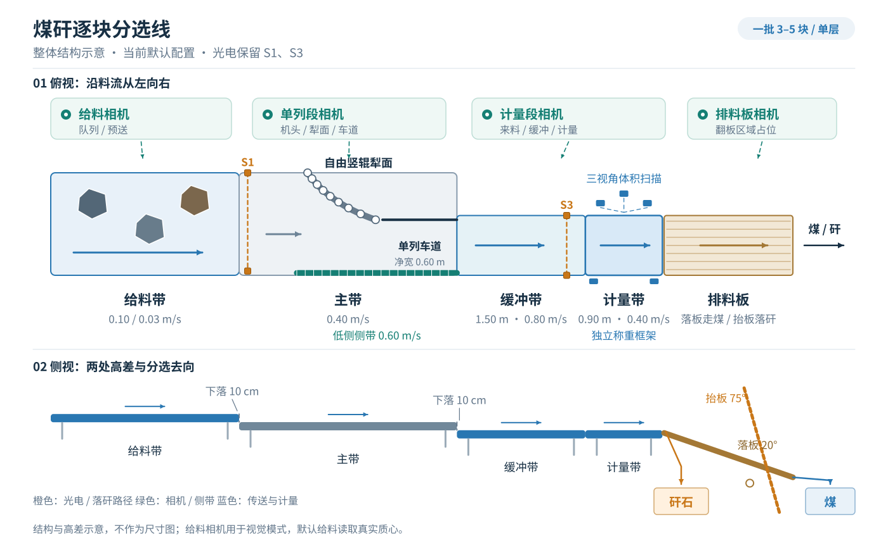

# 煤矸逐块分选线：MuJoCo 三维筛查模型

用于试验样机的机械结构比较和流程排查。当前重点是验证：**一批 3–5 块料，能否让每块料独立称重、测体积**。实验结论见 [实验总览](docs/EXPERIMENTS.md)。

模型未标定，结果只用于模型内的机制筛查，不能作为实物发生率、产能或设备选型依据。



来料为 300–500 mm 粒级原煤 / 矸石，上游保证单层，横向位置和朝向任意，料可相贴；一批走完才放下一批。当前固定一套基线，结构扫描和节拍优化暂停。

## 运行

在项目根目录运行。Windows / PowerShell 首次安装：

```powershell
python -m venv .venv
.\.venv\Scripts\python.exe -m pip install -r requirements.txt
.\.venv\Scripts\Activate.ps1
```

已有虚拟环境可直接激活；后续的 `python` 也可换成 `.\.venv\Scripts\python.exe`。

```powershell
python plough.py                                         # 默认：5 块、随机单层布料、150 s 时限，保存视频
python plough.py --seed 392 --duration 150 --no-video      # 指定种子；不渲染视频
python plough.py --layout aligned --seed 6001 --count 4   # 并齐布料
python plough.py --bench --layout touching --seed 5001    # 只看给料机头，料全落到主带即结束
python plough.py --scenario touching --seed 4004          # 相贴上秤的故障保护场景
python plough.py --help                                   # 全部参数与默认值
```

`--layout` 可选 `scatter`（随机，默认）、`aligned`（并齐）、`touching`（相贴）、`flat`（扁平）、`oblique`（斜放）。`--layout touching` 是初始布料，`--scenario touching` 是计量段验收场景。

临时调整模块常量用 `--set`，会记入结果；例如 `python plough.py --set control.station.APPROACH=.65`。可调常量清单：`python -m singulator.tuning`。

## 当前结构

| 段 | 默认结构 / 速度 | 作用 |
|---|---|---|
| 给料带 | 宽 1.20 m、长 2.20 m，比主带高 10 cm；前送 0.10 m/s、慢走 0.03 m/s | 暂存整批，按预测时机逐块放料 |
| 主带 | 宽 1.20 m，0.40 m/s | 送过犁面和车道，到机头落下 |
| 犁面 / 低侧侧带 | 犁面角度由 55° 转至 20°，9 根 Ø90 mm 自由竖辊；侧带 0.60 m/s | 导向、错开并排料；卡堵时犁面撤离 |
| 单列车道 | 净宽 0.60 m、长 0.90 m | 限制并排通过 |
| 缓冲带 | 宽 0.70 m、长 1.50 m，0.80 m/s，比主带低 10 cm | 用速差拉开已有前后错位的料；计量带忙时暂存 |
| 计量带 | 宽 0.70 m、长 0.90 m，0.40 m/s；与缓冲带平接 | 停带后同时称重和测体积 |
| 排料板 | 宽 0.70 m，UHMW-PE 衬板，两侧挡板高 0.25 m | 按密度分煤 / 矸；分选阈值 1800 kg/m³ 为占位值 |

光电仅保留 S1（给料机头）和 S3（缓冲停位）；缓冲交接由相机跟踪，煤、矸石的排料路径均由健康的排料板相机确认清空，超时或视觉异常时停住。最后一块落仓后仍等待路径确认才结束仿真。

默认控制与计量假设：

- `--sensing vision`：犁面、计量段和报警使用模拟相机、光电、扫描等信号。**给料例外**：`--feeder-sensing oracle --feeder-stop centroid` 直接读取每块料的真实质心和轮廓；头一块质心过机头 3 mm 就停带，让料自行翻下。改用 `--feeder-sensing vision` 时由光束停带。
- `--weigh-model fixed`：停稳后固定 1 s 出数，取最后 0.5 s 的平均；读数稳定性只记录，不作废。`--weigh-model steady` 才要求 3 s 内读数稳定。体积取真实凸包体积，扫描模型只判断本次测量是否有效。
- `--weigh-stop rear --buffer-approach full`：整件刚上计量带就停；缓冲带不提前降速。居中停带和接缝前提前降速分别用 `centre` / `slow` 启用。

多块同称、秤外接触或扫描无效等情况判作废：计量带不排出，给料带暂停，上游按占位停。仿真把作废件直接移出、计一次停机后继续；样机需要人工分开、清理、重测，恢复过程未建模。

犁面撤离后，只有区段走空且整块轮廓不进入复位扫掠区才允许复位；超时停线。各段几何和完整流程见 [给料设计](designs/feeder/DESIGN.md)、[计量段设计](designs/station/DESIGN.md)。

## 结果怎么看

每次单批运行保存到 `runs/<name>_<时间>/`：

| 文件 | 内容 |
|---|---|
| `result.json` | 配置、派生几何、独立测量审计、逐块结局、放料 / 交接 / 计量 / 感知记录和数值诊断 |
| `trajectory.npz` | 每 10 ms 的位姿、质心、接触类别、驱动与活动件状态、称重读数 |
| `model.xml` | 本次运行实际编译的模型 |
| `video.mp4` | 斜视与俯视回放；`--no-video` 仅省去此文件 |

**优先看 `measurement_audit`**，由 `singulator/audit.py` 统一生成。主指标为独立测量成功块数 / 全部投入块数；成功要求测量有效且未撤销、真值单块、无秤外接触、扫描有效。作废移除仍在分母内。

| 字段（位于 `measurement_audit`） | 含义 |
|---|---|
| `counts.input / measured / success_rate` | 投入 / 独立测成块数 / 比值（0–1） |
| `counts.failure_causes`、`lumps` | 未测成原因和逐块明细 |
| `verification` | 错误有效测量、未测落仓、重复有效记录、作废件放行等核验项 |
| `later_checks` | 读数稳定、质量误差、错分和错仓；不进入主指标 |
| `batch` | 数值异常、未完成、需人工、停机次数等；`status` 不能替代主指标 |

故障保护还需满足：`station.counts.void_discharged == 0`，`station.verification` 下的 `false_valid` 和 `landed_unmeasured` 为空。其中 `false_valid` 还含质量误差核验，与主指标的口径不同。完整定义见 [独立测量验收口径](designs/station/DESIGN.md#独立测量验收口径)。

`outcome.classification`、出口间距和 `first_pass_yield` 是通过过程诊断；单列通过不等于独立测成。`numerics.ok` 是数值筛查结果，通过也不代表模型收敛或实物准确。

`runs/` 和 `experiments/results/` 的数据不进 Git，需要长期保留的结果另行备份。

## 自检与批量实验

```powershell
python checks/run_all.py                                 # 快速自检
python checks/run_all.py --full                          # 另加计量段物理验收
python checks/timestep_checks.py                         # 步长敏感性筛查，run_all 不包含它

python experiments/jobs.py --seeds 7201-7260 --configs baseline --out runs/jobs.json
python experiments/run.py --jobs runs/jobs.json --out runs/batch --workers 4
python experiments/analyze.py runs/batch --list           # 逐块审计
```

各自检脚本可单独运行；跑批支持中断后用同一命令续跑。配对比较、放料审计和轨迹分析见 [实验脚本](experiments/README.md)，机头几何矩阵见 [交接小试](designs/transfer_trial/DESIGN.md)。

## 目录导航

| 入口 | 内容 |
|---|---|
| `plough.py`、`singulator/config.py` | 单批命令行、参数和默认值 |
| `singulator/` | 设备、物理、感知、控制、真值核验与仿真；分层和数据流见 [代码结构](docs/ARCHITECTURE.md) |
| `checks/` | 几何、控制、动力学、材料和故障保护自检 |
| [designs/feeder](designs/feeder/DESIGN.md)、[designs/station](designs/station/DESIGN.md) | 设备与控制设计 |
| [designs/transfer_trial](designs/transfer_trial/DESIGN.md)、[designs/flip_separator](designs/flip_separator/README.md) | 给料交接台架、排料板独立模型 |
| [docs/EXPERIMENTS.md](docs/EXPERIMENTS.md) | 当前实验结论及各轮完整记录 |
| [experiments/README.md](experiments/README.md) | 跑批、审计、比较和结果存档 |
| [docs/TODO.md](docs/TODO.md) | 有意推后的问题与后续验证条件 |
| [docs/MATERIAL_MODEL.md](docs/MATERIAL_MODEL.md)、[docs/REALISM_REVIEW.md](docs/REALISM_REVIEW.md) | 材料模型与现实性核查 |

## 已知问题与适用边界

- **一次放下多块仍可能发生**：质心纵向齐平的并排料，速差不一定能拆开；前一块还可能把相贴料拖过机头，需要作废停机。
- **撤离不能解除所有卡堵**：折弯铰点附近和固定车道外壁几乎不动；撤离期间外侧带边敞开，存在掉料风险。
- **默认机头是理想尖边**：实物滚筒会引入交接间距、挂边和拖料，需台架验证；模型可通过 `--feeder-head-d` 等参数调整。
- **给料与计量模型偏理想**：默认给料读真值，称重无秤体动态和皮带张力模型，体积无测量误差，感知噪声和延时未实测标定。
- **物性与动力学尚未标定**：合成凸料、不破碎；块形比例、密度、摩擦、驱动限力均为筛查假设；同批结局可能随步长和平台变化。
- **停机后的过程有简化**：带有有限制动力，但报警后结束模拟，不继续模拟滑行；人工恢复耗时未计入节拍。
